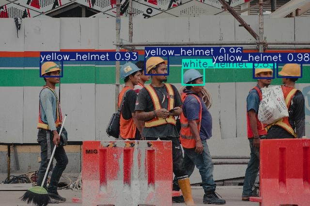
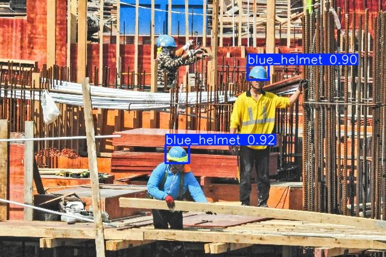
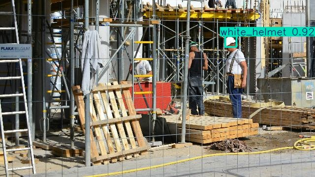

# Análisis de Errores

---

## Falsos Positivos (FP) — El modelo predice una clase incorrecta

### FP-1: `blue_helmet` clasificado como `white_helmet`

- **Por qué:** La imagen cuenta con una desaturacion la cual dificulta que el modelo determinar el color de origeno. El modelo no tiene suficientes imagenes de cascos azules con condiciones de desaturacion.

---

## Falsos Negativos (FN) — El modelo no detecta un casco presente

### FN-1: `blue_helmet`

- **Por qué:** El azul oscuro en condiciones de lejanía o sombre reduce el contraste con los elementos del primer plano. El modelo no tiene suficientes ejemplos de cascos azules en esas condiciones.

### FN-2: `white_helmet`

- **Por qué:** El caso posee etiquetas adheridas que representan nuevas variables a considerar y condicionan al modelo. El modelo no tiene suficientes ejemplos de cascos blancos intervenidos.

### FN-3: `white_helmet`

- **Por qué:** El casco se encuentra detras de una trama de andamios, ocultandolo parcialmente. El modelo no tiene suficientes ejemplos de cascos blancos de baja visibilidad.

---

## 3 Mejoras Prioritarias del Dataset

### Mejora 1 — Imagenes con diferentes ajustes 
- **Problema vinculado:** FP-1
- **Acción:** Incoporar imagenes con diferente saturacion, tono, brillo y contraste.

### Mejora 2 — Incrementar etiquetado
- **Problema vinculado:** FN-1
- **Acción:** Añadir imágenes de cascos azules situados en zonas lejanas a la posicion de la camara y asi poder incrementar el etiquetado en estas condiciones desfavorables.

### Mejora 3 — Cascos parcialmente visibles
- **Problema vinculado:** FN-3
- **Acción:** Incluir imágenes con cascos cuya visibilidad se encuentre comprometida por otro elementos que se encuentran por delante. No etiquetar aquellos cuya visibilidad es menor a un 20%.
